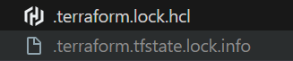

# Terraformをインストールする。

以下のサイトからTerraformをダウンロードする。
https://developer.hashicorp.com/terraform/install

# Windowsの場合
実行バイナリファイルをダウンロードします。

※実行ファイルを指定して実行することもできますが、terraformコマンドで簡単に実行できるように、実行ファイル用にフォルダの作成とパスを通します。

## フォルダを作成する
整理用にフォルダを作成します。今回は以下に作成しますが、任意の場所で大丈夫です。
(※誤動作防止のため、フォルダ名に日本語は使わないようにしましょう。)
```
C:\HashiCorp\Terraform\
```
作成後Terraformの公式サイトからダウンロードしたzipに格納されている`terraform.exe`ファイルを格納します。



## パスを通す
コマンドプロンプトやPowershellなどでコマンドを実行するとき、そのコマンドをあらかじめ指定されているフォルダの中から探します。\
このコマンドを探す対象のフォルダは **PATH** という変数(環境変数)で定義されています。 \
そのため、実行ファイルのあるフォルダを検索対象にいれる設定を **「パスを通す」** といいます。

## 環境変数の Path に terraform.exe があるフォルダを追加する
環境変数とは、その名前の通りOSのシステムで利用できる変数です。
Windowsの他、Mac、Linux等でも存在します。

GUIでシステムのプロパティから編集してもいいですし、Powershellやコマンドプロンプトでも編集できます。

## AWSのクレデンシャル管理方法
Terraformには様々なクレデンシャル管理方法があります。

- 環境変数を利用する

- IAMロールを利用する

Terraformはその特性上、リソースの作成、削除など強い権限が必要になってきます。 \
管理方法として、様々な方法がありますが、ベストプラクティスとして、**静的な認証情報をローカルに置かない** というものがあります。

https://docs.aws.amazon.com/ja_jp/prescriptive-guidance/latest/terraform-aws-provider-best-practices/security.html

```shell
set AWS_ACCESS_KEY {アクセスキーID}
set AWS_SECRET_ACCESS_KEY
```

## 