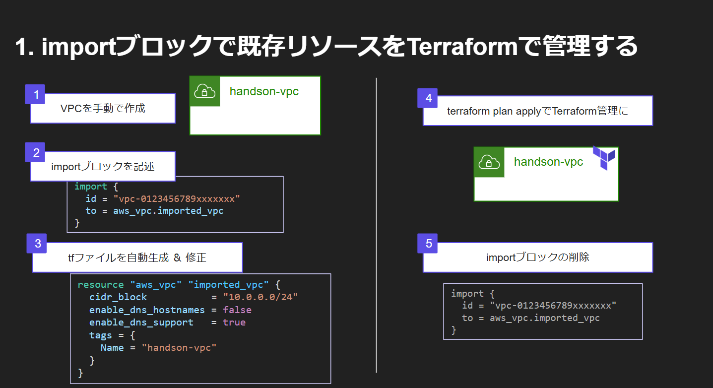
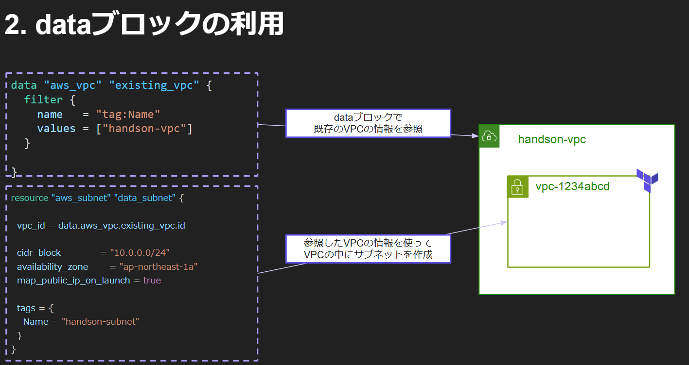
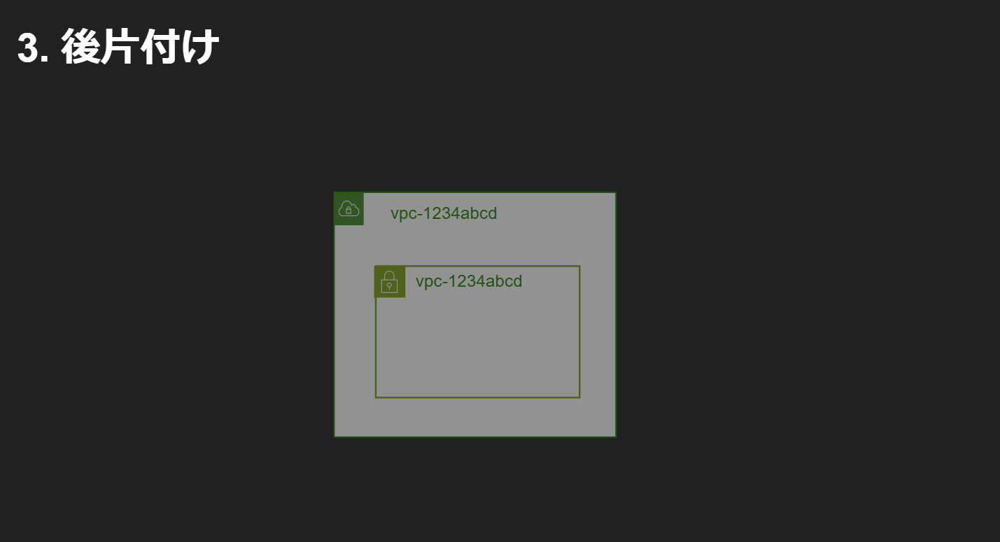

# 概要


importブロックを利用してリソースの作成を行う。
## 1. vpcの作成
- マネコンに移動
- VPCの作成
  - Name:handson-vpc
  - CIDR: 10.0.0.0/24
- vpcidを控えておく

## 2. フォルダの作成
- `C:\Terraform\import`を作成
- `main.tf` を作成

## 3. main.tfの作成

以下を作成(vpcidは控えたものを入力)
```terraform
provider "aws" {
  region = "ap-northeast-1"
}

import {
  id = "【vpcid】"
  to = aws_vpc.imported_vpc
}
```

## 4. terraform plan --generate-config-out=generated.tf コマンド実行
1. 認証情報の設定
2. terraform init
3. terraform plan --generate-config-out=generated.tf
4. 出力ファイルの調整

## 5. 出力ファイルの調整
1. generated.tfの内容を確認
2. 修正してmain.tfに転記

修正前イメージ
```terraform
# __generated__ by Terraform
# Please review these resources and move them into your main configuration files.
# __generated__ by Terraform
resource "aws_vpc" "imported_vpc" {
  assign_generated_ipv6_cidr_block     = false
  cidr_block                           = "10.0.0.0/24"
  enable_dns_hostnames                 = false
  enable_dns_support                   = true
  enable_network_address_usage_metrics = false
  instance_tenancy                     = "default"
  ipv4_ipam_pool_id                    = null
  ipv4_netmask_length                  = null
  ipv6_cidr_block                      = null
  ipv6_cidr_block_network_border_group = null
  ipv6_ipam_pool_id                    = null
  ipv6_netmask_length                  = 0
  tags = {
    Name = "handson-vpc"
  }
  tags_all = {
    Name = "handson-vpc"
  }
}
```

修正後イメージ
```terraform
resource "aws_vpc" "imported_vpc" {
  cidr_block           = "10.0.0.0/24"
  enable_dns_hostnames = false
  enable_dns_support   = true

  tags = {
    Name = "handson-vpc"
  }
}
```

## 6. Terraform plan and apply

1. terraform plan で出力に1 importedがあること確認
2. terrafomr apply
3. tfstateファイルを確認

## 7. importブロックの削除
1. importブロックを削除

# dataブロックの活用



## 1. 作業用ディレクトリの準備
1. `C:\Terraform\data`を作成

main.tfを作成

```terraform
provider "aws" {
  region = "ap-northeast-1"
}

data "aws_vpc" "existing_vpc" {
  filter {
    name   = "tag:Name"
    values = ["handson-vpc"]
  }
}

resource "aws_subnet" "data_subnet" {

  vpc_id = data.aws_vpc.existing_vpc.id

  cidr_block             = "10.0.0.0/24"
  availability_zone       = "ap-northeast-1a"
  map_public_ip_on_launch = true

  tags = {
    Name = "handson-subnet"
  }
}
```

2. terraform init
3. terraform plan
4. terraform apply

このようにdataブロックでリソース情報の参照を行うことでリソースの管理を行わずに参照ができていることがわかります。



# リソースの削除

1. `C:\Terraform\data`でterraform destroyでリソースの削除
2. `C:\Terraform\import`でterraform destroyでリソースの削除