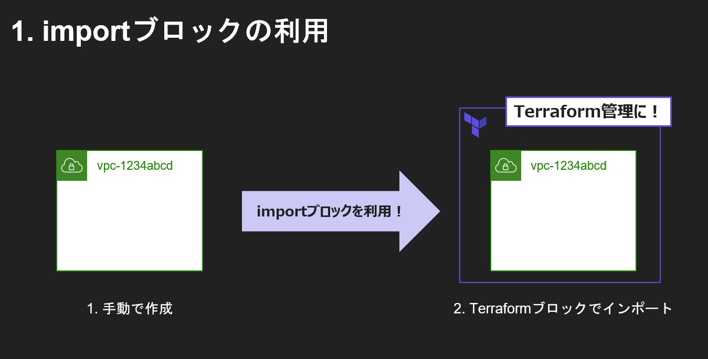

# 概要
本ハンズオンでは実際にTerraformでAWSリソースの操作を行いTerraformを学習してもらいます
1. VPCの作成
2. VPCの名前の編集
3. Terraformで管理する名前を利用しサブネットの作成
4. VPCとサブネットの削除
の４つをTerraformを用い行っていきます。 \
また途中途中で認証情報の設定やtfstateファイル、ロックファイルなども確認しながらすすめていきます
ではハンズオン始めていきましょう


# 事前準備
## 1. Terraformのインストール
インストールを参照
## 2. VSCodeのインストール
インストールを参照
## 3. アクセスキーとシークレットの準備（もしアクセスキーシークレットの講座があれば参照してスキップ、黒川さんの動画をどこかで見たことがある気がするのですが見当たらず・・・・）
1. IAMダッシュボードに移動
2. ユーザをクリック
3. ユーザの作成をクリック
4. ` handson-terraform-user`として作成
5. ポリシーを直接アタッチを選択
6. AdministratorAccess をアタッチ
7. Userの作成



8. Userのセキュリティ認証情報に移動
9. アクセスキーの作成をクリック
10. その他をクリック
11. アクセスキーを作成
12. 後程利用するのでCSVでダウンロード


# 1. main.tfの作成

1. C:\Terrafrom\Handsonフォルダを作成
2. main.tfを作成
3. VSCodeで開く
4. 拡張機能の紹介
5. 以下記載して保存
```terraform
provider "aws" {
 region = "ap-northeast-1"
}
```

# 2. terraform initの実行、結果確認

1. terraform initを実行
2. 作成されたフォルダ.terraformとファイル.terraform.look.fileを確認

# 3. VPCの作成

## 3.1. main.tfを編集（VPC記述）

1. 以下追記
```
resource "aws_vpc" "terra_vpc" {

  cidr_block = "10.0.0.0/16"
  tags = {
    Name = "aws_vpc_name"
  }
}
```

## 3.2. 認証情報の設定
1. terraform planを実行
 →認証情報ないと怒られる
2. 環境変数を設定
```powershell
$Env:AWS_ACCESS_KEY_ID="アクセスキー"
$Env:AWS_SECRET_ACCESS_KEY="シークレットr"
```

## 3.3. terraform planを実行
1. terraform planを実行
2. 実行結果を確認

## 3.4. terraform applyを実行
1. terraform applyを実行
2. 作成されたリソースをマネジメントコンソールで確認
3. tfstateファイルを確認


# 4. VPC名の変更
1. tfファイルの編集（VPC名の変更）
```
resource "aws_vpc" "terra_vpc" {

  cidr_block = "10.0.0.0/16"
  tags = {
    Name = "aws_vpc_handson"
  }
}
```
2. terraform planを実行
3. 実行結果を確認
4. terraform applyを実行
5. 作成されたリソースをマネジメントコンソールで確認

# 5. terraformで管理する名前を使ってサブネットを作成
1. main.tfファイルの編集（Terraformを管理する名前(terra_vpc)を使ってサブネットを作成）
```terraform
resource "aws_subnet" "terra_subnet" {

  vpc_id = aws_vpc.terra_vpc.id

  cidr_block = "10.0.0.0/24"
  tags = {
    Name = "aws_subnet_name"
  }
}
```

2. terraform planを実行
3. 実行結果を確認
4. terraform applyを実行
5. 作成されたリソースをマネジメントコンソールで確認

# 6. リソースの削除

1. main.tfファイルの編集（コメントアウトして削除）
```
# resource "aws_vpc" "terra_vpc" {

#   cidr_block = "10.0.0.0/16"
#   tags = {
#     Name = "aws_vpc_handson"
#   }
# }

# resource "aws_subnet" "terra_subnet" {

#   vpc_id = aws_vpc.terra_vpc.id

#   cidr_block = "10.0.0.0/24"
#   tags = {
#     Name = "aws_subnet_name"
#   }
# }
```
2. terraform planを実行
3. 実行結果を確認
4. terraform applyを実行
5. 作成されたリソースをマネジメントコンソールで確認
6. tfstateファイルを確認
